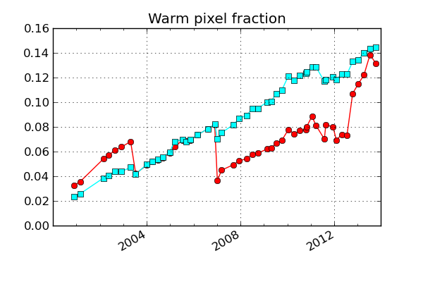

.. mica documentation master file, created by
   sphinx-quickstart on Sun Aug  5 16:28:18 2012.
   You can adapt this file completely to your liking, but it should at least
   contain the root `toctree` directive.

Mica Documentation
================================

Contents:

   :ref:`Mica Archive <archive-label>`

   :ref:`Mica Stats <stats-label>`

   :ref:`Mica VV <vv-label>`

.. _archive-label:

Mica Archive
============

The Archive components of the mica suite provide tools to:

 * retrieve telemetry and processed products from the CXCDS archive
 * store these products in a Ska file archive for speed and convenience
 * quickly retrieve these products 

Mica provides interfaces to these products:

 * `ACA dark current`_
 * `ACA diagnostic telemetry`_
 * `ACA L0 telemetry`_
 * `Aspect L1 products`_
 * `Observation parameters`_

ACA dark current
-------------------------

The :mod:`mica.archive.aca_dark` package provides modules related to the ACA dark current:

 * `Dark current calibrations`_
 * `Dark current modeling`_
 * `Processing`_

Dark current calibrations
^^^^^^^^^^^^^^^^^^^^^^^^^^

The :mod:`mica.archive.aca_dark.dark_cal` module provides functions for retrieving
data for the ACA full-frame dark current calibrations which occur about four
times per year (see the `ACA dark calibrations TWiki page <http://occweb.cfa.harvard.edu/twiki/Aspect/AcaDarkCal>`_).

The functions available are documented in the :ref:`api_aca_dark` section, but the most useful are:

 * :func:`~mica.archive.aca_dark.dark_cal.dark_temp_scale`: get the temperature scaling correction
 * :func:`~mica.archive.aca_dark.dark_cal.get_dark_cal_dirs`: get an ordered dict of dark cal identifer and directory
 * :func:`~mica.archive.aca_dark.dark_cal.get_dark_cal_image`: get a single dark cal image
 * :func:`~mica.archive.aca_dark.dark_cal.get_dark_cal_props`: get properties (e.g. date, temperature) of a dark cal
 * :func:`~mica.archive.aca_dark.dark_cal.get_dark_cal_props_table`: get properties of dark cals over a time range as a table

As an example, let's plot the raw and corrected warm pixel fraction over the mission.  The correction in this case is done to a reference temperature of -15 C::

  from mica.archive.aca_dark import dark_cal
  from Ska.Matplotlib import plot_cxctime
  from Chandra.Time import DateTime

  dark_cals = dark_cal.get_dark_cal_dirs()
  times = []
  n100 = []
  n100_m15 = []
  npix = 1024. * 1024.

  for dark_id in dark_cals:
      print('Reading {}'.format(dark_id))
      props = dark_cal.get_dark_cal_props(dark_id, include_image=True)
      scale = dark_cal.dark_temp_scale(props['ccd_temp'], -15.0)
      image = props['image']
      times.append(props['date'])
      n100.append(np.count_nonzero(image > 100.0) / npix)
      n100_m15.append(np.count_nonzero(image * scale > 100.0) / npix)

  times = DateTime(times).secs
  figure(figsize=(6, 4))
  plot_cxctime(times, n100, 'o-', color='red')
  plot_cxctime(times, n100_m15, 's-', color='cyan')
  grid(True)
  xlim(DateTime('2000:001').plotdate, DateTime().plotdate)
  ylim(0, None)
  title('Warm pixel fraction')

Note that the temperature assigned to a dark calibration is the mean of the temperature
for the invidivual dark replicas (typically 5).  These in turn use ACA hdr3 diagnostic
telemetry for high-resolution temperature readouts which are available before and after
(but not during) each replica.

Dark current modeling
^^^^^^^^^^^^^^^^^^^^^^^

This module will contain functions related to analytical models of the dark current
as well as derived predictions of ACA guide and acquisition performance based on
correlations with the warm pixel fraction.  This is still in work, see :ref:`api_dark_model`.

Processing
^^^^^^^^^^^^^^

This module updates the MICA ACA dark current archive when new dark current calibrations
are completed.  For details see the API documentation at :ref:`api_update_aca_dark`.

Acquisition Success Analysis with Dark Current Data
^^^^^^^^^^^^^^^^^^^^^^^^^^^^^^^^^^^^^^^^^^^^^^^^^^^

See:

.. toctree::
   :maxdepth: 1

   acquisition_data

ACA diagnostic telemetry
-------------------------

The :mod:`mica.archive.aca_hdr3` module works with Header 3 data
(extended ACA diagnostic telemetry) available in 8x8 ACA
L0 image data.  The module provies an MSID class and MSIDset class to fetch
these data as "pseudo-MSIDs" and return masked array data structures.
See :doc:`Header 3 Pseudo-MSIDs <hdr3_only_msids>` for the list
of available pseudo-MSIDs.

   >>> from mica.archive import aca_hdr3
   >>> ccd_temp = aca_hdr3.MSID('ccd_temp', '2012:001', '2012:020')
   >>> type(ccd_temp.vals)
   'numpy.ma.core.MaskedArray'
   >>> from Ska.Matplotlib import plot_cxctime
   >>> figure(figsize=(5, 3.5))
   >>> plot_cxctime(ccd_temp.times, ccd_temp.vals, '.')

   .. image:: plots/plot_cxctime_ccd_temp.png

   >>> perigee_data = aca_hdr3.MSIDset(['ccd_temp', 'aca_temp', 'dac'],
   ...                                 '2012:125', '2012:155')
   >>> figure(figsize=(5, 3.5))
   >>> plot(perigee_data['aca_temp'].vals - perigee_data['ccd_temp'].vals,
   ...      perigee_data['dac'].vals, '.')
   >>> subplots_adjust(bottom=0.15)
   >>> ylabel('TEC DAC Control Level')
   >>> xlabel('ACA temp - CCD temp (C)')

   .. image:: plots/dac_vs_tempdiff.png

Retrieving pseudo-MSIDs with this module will be slower than
Ska.engarchive fetches of similar telemetry, as the aca_hdr3 module
reads from each of the collection of original fits.gz files for a specified
time range.  Ska.engarchive, in contrast, reads from HDF5 files (per
MSID) optimized for fast reads.::

   In [3]: %time ccd_temp = aca_hdr3.MSID('ccd_temp', '2012:001', '2012:020')
   CPU times: user 5.18 s, sys: 0.12 s, total: 5.29 s
   Wall time: 7.46 s

   In [9]: %time quick_ccd = Ska.engarchive.fetch.MSID('AACCCDPT', '2012:001', '2012:020')
   CPU times: user 0.02 s, sys: 0.00 s, total: 0.03 s
   Wall time: 0.81 s

ACA L0 telemetry
----------------

The :mod:`mica.archive.aca_l0` module provides tools to build and fetch from
a file archive of ACA L0 telemetry.  This telemetry is stored in
directories by year and day-of-year, and ingested filenames are stored
in a lookup table.  

Get_files()
^^^^^^^^^^^^

Methods are provided to retrieve files and read those data files into
data structures.

   >>> from mica.archive import aca_l0
   >>> obsid_files = aca_l0.get_files(obsid=5438)
   >>> time_8x8 = aca_l0.get_files(start='2011:001', stop='2011:010',
   ...                             imgsize=[8])
   >>> time_files = aca_l0.get_files(start='2012:001:00:00:00.000',
   ...                               stop='2012:002:00:00:00.000',
   ...                               slots=[0], imgsize=[6, 8])

The values from those files may be read and plotted directly:

   >>> from astropy.io import fits
   >>> from Ska.Matplotlib import plot_cxctime
   >>> figure(figsize=(5, 3.5))
   >>> for aca_file in time_files:
   ...     f = fits.open(aca_file)
   ...     plot_cxctime(f[1].data['TIME'], f[1].data['TEMPCCD'], '.')
   ...

   .. image:: plots/tempccd_from_files.png

Get_slot_data()
^^^^^^^^^^^^^^^

The loop/plot above will break if the images aren't filtered on
"imgsize=[6, 8]", as the 'TEMPCCD' columns is only available in 6x6
and 8x8 data.  That's one reason to use the convenience function
:func:`~mica.archive.aca_l0.get_slot_data()`, as it places the values in a
masked array (masking, for example, TEMPCCD when in 4x4 mode or when
the data is just not available).

   >>> temp_ccd = aca_l0.get_slot_data('2012:001:00:00:00.000',
   ...                                 '2012:002:00:00:00.000',
   ...                                  slot=0, imgsize=[6, 8],
   ...                                  columns=['TIME', 'TEMPCCD'])
   >>> figure(figsize=(5, 3.5))
   >>> plot_cxctime(temp_ccd['TIME'], temp_ccd['TEMPCCD'], '.')

   .. image:: plots/tempccd_from_get_slot_data.png

(it is still wise to filter on imgsize in this example, as there is no
advantage to reading each of the 4x4 files.)

The :func:`~mica.archive.aca_l0.get_slot_data()` method will retrieve
all columns by default and the resulting data structure, as mentioned,
will have masked columns where those values are not available
(i.e. HD3TLM64 in 6x6 or 4x4 image data).  See :doc:`ACA L0
MSIDs/columns <aca_l0_msids>` for the list of available columns.

The aca_l0 archive includes all of the raw image data.  The following
code grabs the image data from slot 2 during a fid shift and creates a
plot of each readout.

   >>> from scipy.stats import scoreatpercentile
   >>> from itertools import izip, count
   >>> slot_data = aca_l0.get_slot_data(98585849, 98585884, slot=2)
   >>> vmax = scoreatpercentile(np.ravel(slot_data['IMGRAW']), 98)
   >>> vmin = scoreatpercentile(np.ravel(slot_data['IMGRAW']), 2)
   >>> norm = mpl.colors.LogNorm(vmin=vmin, vmax=vmax, clip=1)
   >>> for raw, idx in izip(slot_data['IMGRAW'], count()):
   ...     fig = figure(figsize=(4,4))
   ...     imshow(raw.reshape(8,8, order='F'),
   ...            interpolation='none',
   ...            cmap=cm.gray,
   ...            origin='lower',
   ...            norm=norm,
   ...            aspect='equal')
   ...     savefig("slot_2_{0:02d}.png".format(idx))

ImageMagick has been used to knit those plots together::

   convert -delay 20 -loop 0 slot*.png slot_2.gif

to create this:

   .. image:: plots/slot_2.gif

Get_l0_images()
^^^^^^^^^^^^^^^

An alternate way to access ACA L0 image is via the
:func:`~mica.archive.aca_l0.get_l0_images()` function.  This returns a Python list of
``ACAImage`` objects (see the ``chandra_aca.aca_image`` docs for details).  Each of these
objects contains the image along with relevant meta-data for each readout:: ``['TIME',
'IMGROW0', 'IMGCOL0', 'BGDAVG', 'IMGSTAT', 'IMGFUNC1', 'IMGSIZE', 'INTEG']``.

For example::

  >>> imgs = aca_l0.get_l0_images(98585849, 98585884, slot=2)
  >>> imgs[0]  # ACAImage rounds the values for viewing
  <ACAImage row0=-246 col0=116
  array([[  32,   81,   81,  212,  262,   98,   32,   27],
         [  21,   48,  305, 1170,  830,  169,   65,   38],
         [  38,   87,  825, 3434, 2635,  393,  147,   59],
         [  54,  114,  508, 3614, 5408, 1284,  398,   92],
         [  76,  163,  448, 2548, 5534, 1547,  344,  202],
         [  65,  103,  256,  809, 2602, 1656,  426,  114],
         [  16,   38,   54,  327, 1416, 1574,  502,  114],
         [  10,   16,   43,  103,  371, 1191,  491,   92]])>

  >>> imgs[0].aca[-240, 118]  # Access row=-240, col=118
  53.90625

  >>> imgs[0].meta
  {'BGDAVG': 25,
   'IMGCOL0': 116,
   'IMGFUNC1': 1,
   'IMGROW0': -246,
   'IMGSIZE': 8,
   'IMGSTAT': 0,
   'INTEG': 1.696,
   'TIME': 98585849.940383524}

  >>> imgs[0].TIME
  98585849.940383524

  >>> imgs[0].row0, imgs[0].col0  # shortcut: row0 => IMGROW0
  (-246, 116)

Aspect L1 products
------------------

The :mod:`mica.archive.asp_l1` module provides tools to build and fetch from
a file archive of Aspect level 1 products.

Methods are provided to find the archive directory:

   >>> from mica.archive import asp_l1
   >>> asp_l1.get_dir(2121)
   '/data/aca/archive/asp1/02/02121'
   >>> obsdirs = asp_l1.get_obs_dirs(6000)

The obsdirs dictionary should look something like::

  {'default': '/data/aca/archive/asp1/06/06000',
  2: '/data/aca/archive/asp1/06/06000_v02',
  3: '/data/aca/archive/asp1/06/06000_v03',
  'last': '/data/aca/archive/asp1/06/06000',
  'revisions': [2, 3]}

Methods are also provided to retrieve a list files by obsid and time range.

   >>> obs_files = asp_l1.get_files(6000)
   >>> obs_gspr = asp_l1.get_files(6000, content=['GSPROPS'])
   >>> range_fidpr = asp_l1.get_files(start='2012:001',
   ...                                stop='2012:030',
   ...                                content=['FIDPROPS'])

Observation parameters
----------------------

The :mod:`mica.archive.obspar` module provides tools to build and fetch from
a file archive of obspars.

Methods are provided to find the archive directory and obspar files:

   >>> obspar.get_obspar_file(7000)
   '/data/aca/archive/obspar/07/07000/axaff07000_000N002_obs0a.par.gz'
   >>> obspar.get_dir(2121)
   '/data/aca/archive/obspar/02/02121'
   >>> obsdirs = obspar.get_obs_dirs(6000)

The obsdirs dictionary should look something like::

   {'default': '/data/aca/archive/obspar/06/06000',
   2: '/data/aca/archive/obspar/06/06000_v02',
   3: '/data/aca/archive/obspar/06/06000_v03',
   'last': '/data/aca/archive/obspar/06/06000',
   'revisions': [2, 3]}

A method is provided to read the obspar into a dictionary:

   >>> from mica.archive import obspar
   >>> obspar.get_obspar(7001)['detector']
   'ACIS-I'

Methods are also provided to retrieve a list of files by obsid and time range.

   >>> obs_files = obspar.get_files(6000)
   >>> range = obspar.get_files(start='2012:001',
   ...                          stop='2012:030')

And a method is provided to fetch obsids that have obspars:

   >>> obspar.get_obsids('2016:001', '2016:002')
   [51365, 18736, 18036, 18203]

.. _stats-label:

Mica.stats
=============

The :mod:`mica.stats.acq_stats` module includes code to gather acquisition statistics
data for each observation and return those data to the user.

Access stats data
-----------------

To get the whole acquisition table data:

   >>> from mica.stats.acq_stats import get_stats
   >>> stats = get_stats()
   >>> stats[(stats['obsid'] == 5438) & (stats['slot'] == 1)][0]['dy']
   8.4296239297976854

The hdf5 in-kernel searches may be faster working with the table directly for some
operations.

.. _vv-label:

Mica.VV
==============

The :mod:`mica.vv` module provides tools to create and inspect V&V-type data

Access Mica V&V Data
--------------------

Locate mica v&v products:

   >>> from mica.vv import get_vv_dir
   >>> get_vv_dir(16504)
   '/data/aca/archive/vv/16/16504_v01'

List files:

   >>> from mica.vv import get_vv_files
   >>> get_vv_files(16504)
   ['/data/aca/archive/vv/16/16504_v01/vv_report.json',
    '/data/aca/archive/vv/16/16504_v01/vv_slot.pkl',
    '/data/aca/archive/vv/16/16504_v01/vv_report.pkl',
    '/data/aca/archive/vv/16/16504_v01/slot_0_yz.png',
    ...

Retrieve all residuals:

   >>> from mica.vv import get_rms_data
   >>> data = get_rms_data()
   >>> data[data['obsid'] == 16505]['dz_rms']
   array([  2.62251067e-05,   5.16913551e-02,   5.32668958e-02,
            4.78861857e-02])

Retrieve mica v&v values for an already-mica-processed obsid.  The dictionaries of
values still need more documentation at this time.

   >>> from mica.vv import get_vv
   >>> obs = get_vv(16504)
   >>> obs['slots']['7']['dz_rms']
   0.11610256063309182

Run mica V&V tools directly
---------------------------

Using the mica-archived aspect solution and obspar, run the mica obsid tools

   >>> from mica.vv import get_arch_vv
   >>> obi = get_arch_vv(2121)

Plot slot 4 residuals

   >>> obi.plot_slot(4)

Look at the SIM drift values

   >>> obi.info()['sim']
   {'max_d_dy': 0.002197265625,
    'max_d_dz': 0.0018472671508789062,
    'max_medf_dy': 3.3234403133392334,
    'max_medf_dz': 7.3717021942138672,
    'min_medf_dy': 3.0496618747711182,
    'min_medf_dz': 6.3389387130737305}

The Obi class can also be called directly on data that isn't in the mica archive. For
example, on c3po-v, something like this could be used to plot residuals on un-ingested
data (these directories will likely not exist to run this example in the future):

   >>> proc_dir = '/dsops/ap/sdp.10/opus/prs_run/done/ASP_L1____502323245n674/'
   >>> aspect_dir = proc_dir  + 'output'
   >>> obspar = proc_dir + 'input/axaff14565_000N001_obs0a.par'
   >>> import mica.vv
   >>> obi = mica.vv.Obi(obspar, aspect_dir)

API docs
========

.. toctree::
   :maxdepth: 1

   api

MSID descriptions
=================

.. toctree::
   :maxdepth: 1

   aca_l0_msids
   hdr3_only_msids

Indices and tables
==================

* :ref:`genindex`
* :ref:`modindex`
* :ref:`search`
